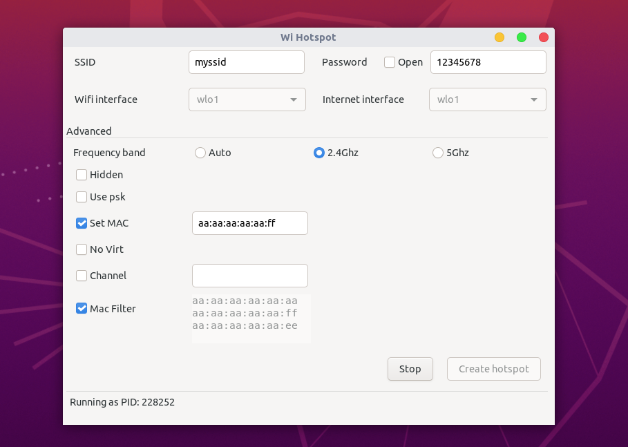

## Linux Wifi Hotspot

[](https://travis-ci.com/lakinduakash/linux-wifi-hotspot)
[](https://gitter.im/linux-wihotspot/community?utm_source=badge&utm_medium=badge&utm_campaign=pr-badge)

### Update
* Add MAC filter
* Support enabling IEEE80211n and IEEE80211ac
* Release Debian package

### Features
 
* Share your wifi like in Windows - Use wifi and enable hotspot at the same time.
* Share access point from any network interface
* MAC filter
* Includes Both command line and gui.
* Support both 2.4GHz and 5GHz (Need to be compatible with your wifi adapter). Ex: You have connected to the 5GHz network and share a connection with 2.4GHz.
* Select Channel.
* Hide SSID




### Command line help and documentation

Read [Command line help and documentation here](src/scripts/README.md).

If you only need the command-line without GUI run `make install-cli-only` as root user.

### Notes

Sometimes there are troubles with **5Ghz bands** due to some vendor restrictions. If you cannot start hotspot while you are connected to 5Ghz band, Unselect **Auto** and select **2.4Ghz** in frequency selection.

If any problems with **RealTeK Wifi Adapters** see [this](docs/howto/realtek.md)

### Installation

#### Debian/Ubuntu
Download the debian package from latest [release](https://github.com/lakinduakash/linux-wifi-hotspot/releases/latest)
- [linux-wifi-hotspot_3.5.1_amd64.deb](https://github.com/lakinduakash/linux-wifi-hotspot/releases/download/v3.5.1/linux-wifi-hotspot_3.5.1_amd64.deb)

#### Arch based distributions

Install with:

```bash
yay -S linux-wifi-hotspot
```

### Dependencies

#### General
* bash
* util-linux (for getopt)
* procps or procps-ng
* hostapd
* iproute2
* iw
* iwconfig (you only need this if 'iw' can not recognize your adapter)
* haveged (optional)

_Make sure you have those dependencies by typing them in terminal. If any of dependencies fail
install it using your distro's package manager_

#### For 'NATed' or 'None' Internet sharing method
* dnsmasq
* iptables

#### To build from source

* make
* gcc and g++
* build-essential
* pkg-config
* gtk
* libgtk-3-dev

On Ubuntu or debian install dependencies by,

```bash
sudo apt install -y libgtk-3-dev build-essential gcc g++ pkg-config make hostapd
```

## Installation

    git clone https://github.com/lakinduakash/linux-wifi-hotspot
    cd linux-wifi-hotspot

    #build binaries
    make

    #install
    sudo make install
    
## Uninstallation
    sudo make uninstall
    
## Running
You can launch the GUI by searching for "Wifi Hotspot" in the Application Menu
or using the terminal with:

    wihotspot

## Run on Startup
The `wihotspot` GUI uses `create_ap` to create and manage access points. This service and core logic was originally created by
[@oblique](http://github.com/oblique), and are now maintained in this
repository.

Start the hotspot service on startup (using your saved configuration) with:

    systemctl enable create_ap

### Tested with Ubuntu from 16.04 to 20.04. If any issue is found, file an issue on github.

## Contributing

If you found a bug or you have an idea about improving this make an issue. Even a small contribution make open source world more beautiful.
Please read [CONTRIBUTING.md](CONTRIBUTING.md) for more info.


## License
FreeBSD

Copyright (c) 2013, oblique

Copyright (c) 2020, lakinduakash
