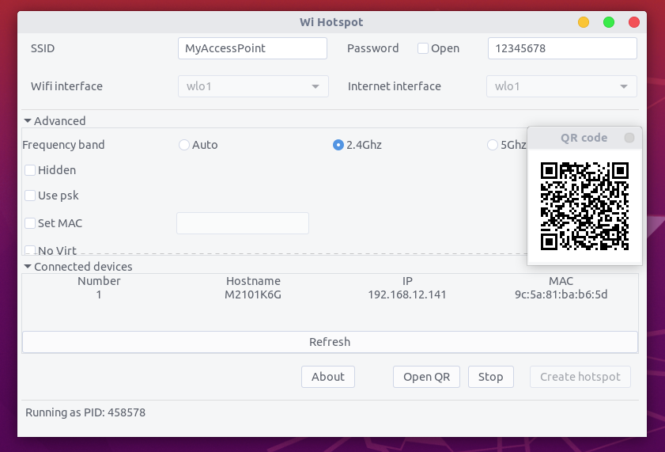

## Linux Wifi Hotspot

<!-- [](https://travis-ci.com/lakinduakash/linux-wifi-hotspot) -->

<!--[](https://gitter.im/linux-wihotspot/community?utm_source=badge&utm_medium=badge&utm_campaign=pr-badge) -->
[](https://app.fossa.com/projects/git%2Bgithub.com%2Flakinduakash%2Flinux-wifi-hotspot?ref=badge_shield)


### What's new
* The GUI now shows the full `create_ap` log in a scrollable box instead of just the last line ([#527](https://github.com/lakinduakash/linux-wifi-hotspot/pull/527))
* 5GHz hotspots now work on Intel adapters - new [guide and helper scripts](docs/howto/intel-5ghz-lar.md) to restore the removed `iwlwifi` `lar_disable` parameter ([#527](https://github.com/lakinduakash/linux-wifi-hotspot/pull/527))
* The hotspot now follows the channel your WiFi client is on instead of failing with `Failed to set beacon parameters` ([#527](https://github.com/lakinduakash/linux-wifi-hotspot/pull/527))
* Frequency band selection in the GUI no longer silently falls back to 2.4GHz ([#527](https://github.com/lakinduakash/linux-wifi-hotspot/pull/527))
* `--ieee80211ac` can now actually reach 80MHz, with the new `--vht-chwidth` option ([#527](https://github.com/lakinduakash/linux-wifi-hotspot/pull/527))
* Errors from `create_ap` are now shown in the GUI instead of failing silently ([#525](https://github.com/lakinduakash/linux-wifi-hotspot/pull/525))
* WiFi and Internet interfaces are preselected, so hotspot creation works out of the box ([#525](https://github.com/lakinduakash/linux-wifi-hotspot/pull/525))
* Virtual interfaces are no longer refused on PCIe/USB `brcmfmac` adapters ([#525](https://github.com/lakinduakash/linux-wifi-hotspot/pull/525))
* Use aa-complain instead of complain to fix the permission issue for dnsmasq
* Fix some 5Ghz band not working issue
* Compatible with iw 6.7

#### Project Update

Hi everyone — I've been inactive on this project for a while due to other commitments. I'm now actively looking for contributors and maintainers to help keep the project alive and growing.

If you're interested in contributing — whether it's fixing bugs, improving documentation, or developing new features — please open an issue to introduce yourself.

I'm also open to adding trusted collaborators with commit access who demonstrate consistent contributions and interest.

Thanks for being part of the community and keeping Linux-WiFi-Hotspot going!

### Features

* Share your wifi like in Windows - Use wifi and enable hotspot at the same time.
* Share a wifi access point from any network interface
* [Create a hotspot with VPN](#vpn-hotspot) - The hotspot has the traffic tunnelled through VPN. Useful for devices with no VPN app support like TV or gaming consoles.
* Share wifi via QR code
* MAC filter
* View connected devices
* Includes Both command line and GUI.
* Support both 2.4GHz and 5GHz (Need to be compatible with your wifi adapter). Ex: You have connected to the 5GHz network and share a connection with 2.4GHz.
* Customise wifi Channel, Change MAC address, etc.
* Hide SSID
* customize gateway IP address
* Enable IEEE 80211n, IEEE 80211ac and IEEE 80211ax modes




### Command line help and documentation

Read [Command line help and documentation here](src/scripts/README.md).

If you only need the command line without GUI run `make install-cli-only` as the root user.

### Notes

- **5Ghz hotspot will not start:** on Intel (`iwlwifi`) adapters this is almost always the adapter's firmware keeping every 5GHz channel flagged `no IR`, which forbids beaconing. See [5GHz hotspots on Intel adapters](docs/howto/intel-5ghz-lar.md) - it explains how to confirm it and includes scripts that fix it. As a quick workaround, unselect **Auto** and select **2.4Ghz** in frequency selection.

- **`Failed to set beacon parameters`:** many adapters can only host an access point on the channel their WiFi client is already using, so the hotspot follows your current connection. Connect to a 2.4GHz network for a 2.4GHz hotspot, or a 5GHz one for 5GHz. See [the same guide](docs/howto/intel-5ghz-lar.md#the-other-restriction-one-channel-at-a-time).

- If any problems with **RealTeK Wifi Adapters** see [this](docs/howto/realtek.md)

- **Unable to allocate IP: firewalld issue:** firewalld keeps its own ruleset, which drops the hotspot's DHCP and DNS traffic no matter what `create_ap` adds with `iptables`, so clients associate but never get an address. `create_ap` now puts the AP interface in firewalld's `nm-shared` zone and enables masquerading on the uplink's zone for as long as the hotspot runs, the same way NetworkManager handles a shared connection. If you are on an older release, or want to do it by hand, see [#209](https://github.com/lakinduakash/linux-wifi-hotspot/issues/209) [#166](https://github.com/lakinduakash/linux-wifi-hotspot/issues/166)

- **Clients see the hotspot but cannot connect:** if devices keep associating and disconnecting, your adapter's firmware may not support AP mode with encryption. `create_ap` now warns when it detects this. Broadcom adapters in T2 Macs are known to be affected, and no `create_ap` option works around it - a USB WiFi adapter is needed. See [#525](https://github.com/lakinduakash/linux-wifi-hotspot/pull/525).

## Installation

#### Debian/Ubuntu ( deprecated - build yourself )

Download the Debian package from the latest [release](https://github.com/lakinduakash/linux-wifi-hotspot/releases/latest)

**OR**
Good news! I was able to restore keys, new versions will be available via the PPA
```bash
sudo add-apt-repository ppa:lakinduakash/lwh
sudo apt update
sudo apt install linux-wifi-hotspot

```

#### Arch based distributions ( deprecated - build yourself )

Linux Wifi Hotspot is available as an [AUR package](https://aur.archlinux.org/packages/linux-wifi-hotspot/). You can install it manually or with your favorite AUR helper.
For example, if you use `yay` you can do:
`yay -S linux-wifi-hotspot`

### Fedora based distributions
copr based repo is available for Fedora 
```bash
sudo dnf copr enable zinix01/linux-wifi-hotspot
sudo dnf install linux-wifi-hotspot 
```

## Dependencies

#### General
* bash
* util-linux (for getopt)
* procps or procps-ng
* hostapd
* iproute2
* iw
* iwconfig (you only need this if 'iw' can not recognize your adapter)
* haveged (optional)

_Make sure you have those dependencies by typing them in terminal. If any of dependencies fail
install it using your distro's package manager_

#### For 'NATed' or 'None' Internet sharing method
* dnsmasq
* iptables

#### To build from source

* make
* gcc and g++
* build-essential
* pkg-config
* gtk
* libgtk-3-dev
* libqrencode-dev (for qr code generation)
* libpng-dev (for qr code generation)

On Ubuntu or Debian install dependencies by,

```bash
sudo apt install -y libgtk-3-dev build-essential gcc g++ pkg-config make hostapd libqrencode-dev libpng-dev
```

On Fedora/CentOS/Red Hat Enterprise Linux/Rocky Linux/Oracle Linux
```bash
sudo dnf install -y gtk3-devel gcc gcc-c++ kernel-devel pkg-config make hostapd qrencode-devel libpng-devel
```

## Installation

    git clone https://github.com/lakinduakash/linux-wifi-hotspot
    cd linux-wifi-hotspot

    #build binaries
    make

    #install
    sudo make install

## Uninstallation
    sudo make uninstall

## Running
You can launch the GUI by searching for "Wifi Hotspot" in the Application Menu
or using the terminal with:

    wihotspot

<h2 id="vpn-hotspot">Create VPN Hotspot</h2>

After connecting to VPN, Open `wihotspot` GUI. Select the virtual interface created by the VPN. In this case it is `tun0`


## Run on Startup
The `wihotspot` GUI uses `create_ap` to create and manage access points. This service and core logic were originally created by
[@oblique](http://github.com/oblique), and are now maintained in this
repository.

Start the hotspot service on startup (using your saved configuration) with:

    systemctl enable create_ap


## Contributing

If you found a bug or you have an idea about improving this make an issue. Even a small contribution makes the open source world more beautiful.
Please read [CONTRIBUTING.md](CONTRIBUTING.md) for more info.

## Disclaimer
<div>Icons made by <a href="https://www.freepik.com" title="Freepik">Freepik</a> from <a href="https://www.flaticon.com/" title="Flaticon">www.flaticon.com</a></div>


## Stargazers over time

[](https://starchart.cc/lakinduakash/linux-wifi-hotspot)


## License
FreeBSD

Copyright (c) 2013, oblique

Copyright (c) 2024, lakinduakash


[](https://app.fossa.com/projects/git%2Bgithub.com%2Flakinduakash%2Flinux-wifi-hotspot?ref=badge_large)
