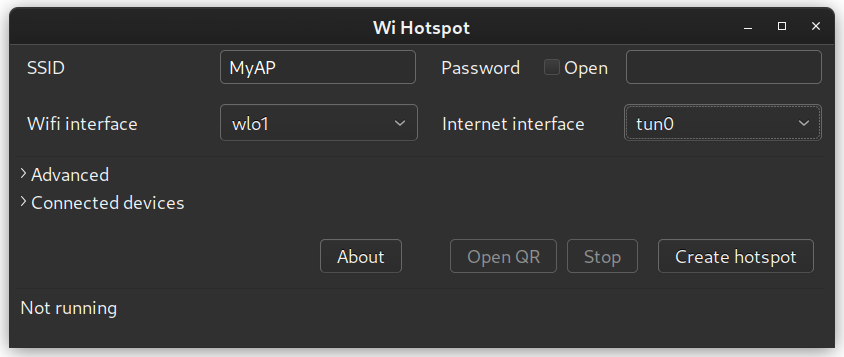

## Linux Wifi Hotspot


## Installation

    git clone https://github.com/chitti-a7r4/linux-wifi-hotspot.git
    cd linux-wifi-hotspot

    #build binaries
    make

    #install
    sudo make install

## Quick Start (auto.sh)

For automated hotspot setup from terminal, use the included `auto.sh` script:

```bash
chmod +x auto.sh
./auto.sh [wifi_iface] [ssid] [passphrase] [--dry-run]
```

Examples:

```bash
./auto.sh
./auto.sh wlp61s0 MyAccessPoint 12345678
./auto.sh wlp61s0 MyAccessPoint 12345678 --dry-run
```

Notes:
- Script detects channel from current Wi-Fi interface.
- Passphrase must be 8 to 63 characters.
- Requires `iw` and `create_ap` to be installed.

## Uninstallation
    sudo make uninstall

## Running
You can launch the GUI by searching for "Wifi Hotspot" in the Application Menu
or using the terminal with:

    wihotspot

<h2 id="vpn-hotspot">Create VPN Hotspot</h2>

After connecting to VPN, Open `wihotspot` GUI. Select the virtual interface created by the VPN. In this case it is `tun0`




## Run on Startup
The `wihotspot` GUI uses `create_ap` to create and manage access points. This service and core logic were originally created by
[@oblique](http://github.com/oblique), and are now maintained in this
repository.

Start the hotspot service on startup (using your saved configuration) with:

    systemctl enable create_ap


